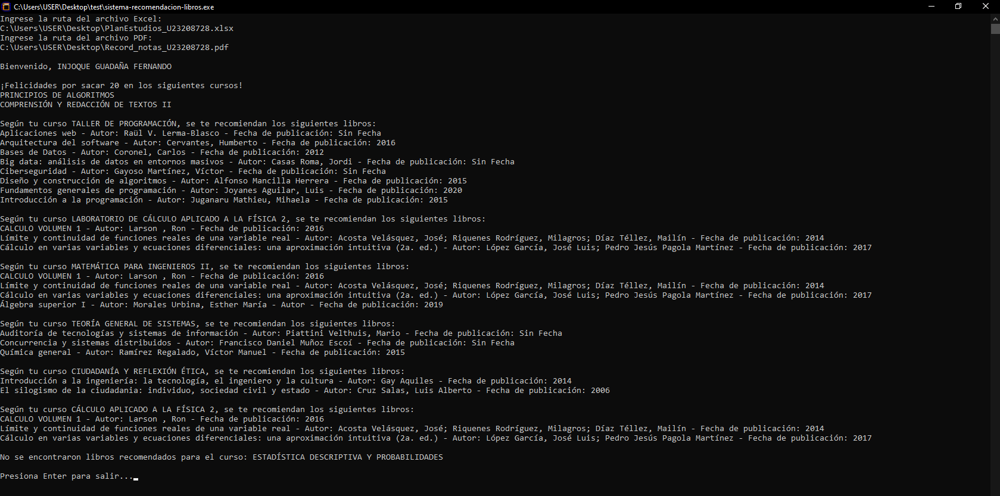

# Estado del Proyecto

_La última versión es 1.0. Este archivo se actualizó por última vez el 10 de abril de 2024._

# Bibliia - El sistema de recomendación de libros

Bibliia es un sistema de recomendación de libros desarrollado en Java que busca ayudar a estudiantes de ingeniería de la Universidad Tecnológica del Perú a tomar decisiones informadas sobre qué libros leer en función de su avance académico. El sistema utiliza un enfoque basado en la similitud de palabras clave para buscar y filtrar libros académicos que estén relacionados con los cursos actuales de cada estudiante.

1. [Inicio Rápido](#inicio-rápido)
2. [Funcionamiento](#funcionamiento)
3. [Consideraciones](#consideraciones)
4. [Impedimentos](#impedimentos)
5. [Hoja de Ruta](#hoja-de-ruta)
6. [Capturas de Pantalla](#capturas-de-pantalla)
7. [Contribución](#contribución)
8. [Agradecimientos](#agradecimientos)
9. [Licencia](#licencia)

## Inicio Rápido

1. Descarga el archivo [bibliia.exe](bibliia.exe) y ejecútalo.
2. Se abrirá una ventana de comandos (cmd), en la cual se te solicitará que ingreses la ruta de los archivos del Plan de Estudios (en formato Excel, .xlsx) y posteriormente del Registro de Notas (en formato PDF, .pdf). Puedes probar con los archivos de ejemplo disponibles en la carpeta [archivos-prueba](archivos-prueba).
3. Una vez que hayas proporcionado la ruta de ambos archivos, el sistema los convertirá y analizará para ofrecerte recomendaciones basadas en tus cursos `En curso`. Además, si has obtenido una calificación de 20 en algún curso, el sistema te felicitará.
4. Una vez que hayas revisado las recomendaciones, presiona la tecla Enter para finalizar el proceso.

### Nota

La forma de escribir la ruta de un archivo es la siguiente:

```
Disco:\Carpeta\...\archivo.formato
```

Por ejemplo, si el archivo está en tu escritorio, su ruta se escribiría así:

```
C:\Users\USER\Desktop\Record_notas_U23208728.pdf
```

Es crucial recordar incluir el formato al final del nombre del archivo (`.xlsx` o `.pdf`); de lo contrario, no será reconocido.

Cualquier espacio adicional antes, después o entre la ruta será considerado como un error. Asegúrate de verificar antes de presionar Enter.

Si estás experimentando dificultades con el archivo Excel, es posible que su extensión sea `.xls` en lugar de `.xlsx`. Para resolver este problema, consulta el punto número 2 de la sección de [Consideraciones](#consideraciones).

Si estás utilizando un antivirus, es posible que inicialmente la ventana de comandos se abra dentro de una instancia creada por el antivirus. Después de analizar el ejecutable durante unos segundos, el antivirus volverá a abrir la ventana de comandos, lo que podría borrar lo que hayas ingresado durante ese período. Por lo tanto, es aconsejable revisar y esperar unos segundos para evitar escribir la información dos veces.

## Funcionamiento

El funcionamiento del sistema es el siguiente:

1. **Ingreso de datos:** El usuario introduce su Plan de Estudios en formato Excel (.xlsx) y su Récord de Notas en formato PDF. El Plan de Estudios debe contener información sobre los cursos completados y pendientes, incluyendo requisitos previos y posteriores, mientras que el Récord de Notas debe incluir las calificaciones obtenidas en cursos ya finalizados.
2. **Procesamiento de datos:** El sistema analiza y convierte el Plan de Estudios y el Récord de Notas a formato de texto plano (.txt). Posteriormente, compara, identifica y almacena la información coincidente de los cursos, etiquetándolos como `Aprobado` o `Convalidado`, junto con sus requisitos y calificaciones, en mapas y conjuntos. Los cursos que aún están `En Curso` se guardan en un conjunto aparte para su uso posterior.
3. **Lectura de la Base de Datos de Libros:** El sistema lee la base de datos de libros desde el archivo de texto proporcionado. Se procesa la información de cada libro línea por línea, extrayendo el título, autor y fecha de publicación, y se almacena esta información en listas correspondientes a cada objeto Libro.
4. **Sistema de Recomendación:** El sistema compara el título de cada libro con los cursos `En Curso` normalizados, utilizando un enfoque basado en la similitud de palabras clave. Si se encuentra alguna coincidencia entre el título del libro y algún curso en progreso, se recomienda ese libro al usuario. El objetivo es determinar qué libros son más relevantes para el usuario en función de su Plan de Estudios.
5. **Interacción con el Usuario:** La interacción con el usuario se lleva a cabo a través de la consola.

## Consideraciones
1. La base de datos de libros en formato de archivo de texto (.txt) ha sido creada manualmente utilizando la información pública obtenida de la [biblioteca virtual de la Universidad Tecnológica del Perú](https://tubiblioteca.utp.edu.pe/).
2. La exportación del archivo de Récord de Notas desde [UTP Portal+](https://portal.utp.edu.pe) se realiza en formato `.xls`, que es una extensión utilizada en versiones antiguas de Excel. A pesar de intentar utilizar bibliotecas externas como Apache POI, resulta prácticamente imposible reescribir su contenido. Incluso al intentar convertirlo manualmente a formato de texto plano y luego reconstruirlo en `.xlsx`, se encontraron numerosos errores. Por lo tanto, antes de cargar el archivo de Récord de Notas, es necesario convertirlo a formato .xlsx utilizando un conversor de hojas de cálculo.

## Impedimentos
1. Este sistema ha sido diseñado siguiendo el formato utilizado por la Universidad Tecnológica del Perú para organizar su Plan de Estudios y Récord de Notas. La conversión a formato de texto plano (.txt) es específica para estos formatos, lo que significa que archivos de Plan de Estudios y/o Récord de Notas provenientes de otras universidades podrían tener dificultades de formato y escalabilidad para ser analizados.
2. La [base de datos de libros](base_datos_libros.txt) contiene únicamente 36 libros seleccionados de la sección `Libros Base por Carrera` de la carrera de Ingeniería, obtenidos de la biblioteca virtual de la Universidad Tecnológica del Perú. Estos libros abarcan diversas áreas de Ingeniería, entre las que se incluyen: Sistema e Informática, Biomédica, Electrónica, Económica y Empresarial, Mecatrónica, Eléctrica y de Potencia, Seguridad Industrial y Minera, Telecomunicaciones, Seguridad Laboral y Ambiental, Industrial, Textil y de Confecciones, Minas, y Empresarial.

## Hoja de Ruta
1. El sistema enfrenta dificultades con la similitud exacta de palabras, las cuales se han abordado en gran medida mediante el archivo de texto [stopwords](stopwords.txt). Este archivo permite excluir preposiciones, artículos y conectores comunes, evitando que se consideren como sinónimos. Sin embargo, persisten problemas en casos de palabras generales como, justamente, "general", donde un libro que contiene esta palabra puede ser recomendado para un curso que también la incluye, como por ejemplo, el libro `Química GENERAL` recomendado para el curso de `Teoría GENERAL de Sistemas`. Además, el diccionario de sinónimos creado manualmente es demasiado general y no es escalable para considerar todos los posibles cursos de Ingeniería. Por lo tanto, Bibliia actualmente solo funciona bien para cursos generales, ya que no se dispone de información sobre los cursos específicos de todas las ingenierías.

   Para abordar estas limitaciones, se propone el uso de procesamiento de lenguaje natural (NLP) mediante bibliotecas como Stanford NLP Library o Apache OpenNLP, que ofrecen modelos en español y funcionalidades como tokenización y segmentación de oraciones. Aunque se ha estado probando internamente, aún se requiere obtener resultados confiables para su implementación.

2. Me gustaría que este proyecto se expanda en varios aspectos en el futuro. Primero, aumentar la cantidad de libros disponibles en la base de datos. Esto podría lograrse recolectando información manualmente, aunque el proceso consume mucho tiempo. Sería ideal obtener una muestra más amplia por parte de la misma Universidad Tecnológica del Perú.

   Segundo, ampliar la utilidad del proyecto para beneficiar a estudiantes de todas las carreras, no solo de Ingeniería. Esto requeriría la creación de un diccionario más extenso y una base de datos con una variedad más amplia de libros.

   Tercero, extender el proyecto para su uso en otras universidades del Perú, como la Universidad de Lima, la Universidad Peruana de Ciencias Aplicadas, la Universidad San Ignacio de Loyola, la Pontificia Universidad Católica del Perú, la Universidad del Pacífico, entre otras. Para lograr esto, se necesitaría el apoyo de estudiantes de esas universidades para descargar sus respectivos Planes de Estudio y Registros de Notas, y así tomar como ejemplo los formatos de cada universidad para que Bibliia pueda realizar un análisis adecuado de los documentos. Esto también implicaría obtener información sobre los libros disponibles en las bibliotecas virtuales de cada institución. Por lo tanto, sería factible crear un menú que permita a los usuarios seleccionar su universidad para que el sistema pueda leer correctamente sus archivos correspondientes.

## Capturas de Pantalla



## Contribución

¡Las contribuciones de código son bienvenidas! Por favor, confirma cualquier _pull request_ en la rama `main`. Obten más información sobre cómo contribuir leyendo las [Pautas de contribución](https://contributing.bitwarden.com/contributing/). Consulta la [Documentación de contribución](https://contributing.bitwarden.com/) para saber cómo comenzar con tu primera contribución.

La forma más sencilla de contribuir es utilizando Bibliia y enviando cualquier comentario que tengas a mi correo electrónico. Me interesa conocer cómo se utiliza Bibliia en diferentes contextos y estaré encantado de incluir capturas de pantalla en el [README.md](README.md) si las posees. Además, las contribuciones de código son bienvenidas en cualquier forma, desde correcciones ortográficas hasta la implementación de nuevas funciones.

Para obtener más detalles, consulta el archivo [CONTRIBUTING.md](CONTRIBUTING.md).

## Agradecimientos

* Gracias a Alir3z4 por proporcionar una lista de _stopwords_ comunes del Español. Su repositorio está disponible [aquí](https://github.com/Alir3z4/stop-words).

## Licencia

GNU General Public License, versión 3 o posterior.
